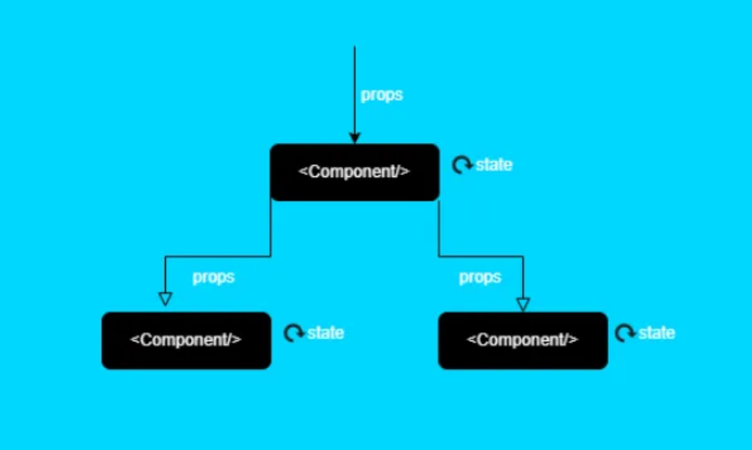

# Component ve Props

## Component

React, kullanıcı arayüzlerini oluşturmak için bileşen (component) tabanlı bir yaklaşım benimser. Bileşenler, UI'ın yeniden kullanılabilir ve bağımsız parçalarıdır. Her bileşen kendi yapısına, verisine ve davranışına sahiptir ve genellikle bir JavaScript fonksiyonu veya sınıfı olarak tanımlanır. React'te bileşenler, büyük ve karmaşık kullanıcı arayüzlerini daha yönetilebilir, yeniden kullanılabilir parçalara ayırmak için kullanılır.

<div style="display: flex; justify-content: center; align-items: center;">

</div>

### React'ta Bileşen Oluşturma

React'te bir bileşen iki şekilde oluşturulabilir: Fonksiyon Bileşenleri ve Sınıf Bileşenleri. ŞUan da Functional Component kullanıldığı için bu alana yoğunlaşacağız.

Fonksiyon bileşenleri, ES6 arrow fonksiyonları kullanılarak veya normal bir fonksiyon olarak tanımlanabilir. React 16.8 sürümüyle birlikte, fonksiyon bileşenlerine "Hooks" eklenmiş olup, bu sayede fonksiyon bileşenlerinde durum (state) ve diğer React özellikleri kullanılabilir hale gelmiştir.

```jsx
import React from "react";

function Welcome(props) {
  return <h1>Merhaba, {props.name}</h1>;
}

// veya Arrow Function ile
const Welcome = (props) => {
  return <h1>Merhaba, {props.name}</h1>;
};
```

Componentlar aslında hem bütünü temsil ederken diğer tarafdan da parçayı ifade eder . Bu yüzden her bir bileşeni oluşturuken dikkat etmemiz gereken bazı kavramlar vardır bunlar şu şekilde sıralanabilir.

1. **Tek Bir Amaca Hizmet**
   Bir bileşen yalnızca bir iş yapmalıdır. Eğer bir bileşen birden fazla iş yapıyorsa, onu daha küçük bileşenlere ayırmak iyi bir fikirdir. Bu yaklaşım, bileşenlerinizi daha anlaşılır ve yeniden kullanılabilir kılar.

2. **State ve Yaşam Döngüsü Yöntemlerini Akıllıca Kullanma**
   Bileşen durumunu (state) ve yaşam döngüsü yöntemlerini gerektiğinde kullanın. Gereksiz durum kullanımı veya yaşam döngüsü yöntemlerinin kötüye kullanımı, bileşenlerinizin karmaşıklığını artırabilir.

3. **Componentler Arası İletişim**
   Bileşenler arasında veri akışını anlamak ve yönetmek önemlidir. Genellikle, veri Parent'dan Child'a props aracılığıyla aktarılır. Context API veya state yönetim kütüphaneleri (Redux, MobX) gibi araçlar, karmaşık uygulamalarda veri yönetimini kolaylaştırabilir.

4. **Yeniden Kullanılabilirlik ve Kompozisyon**
   Bileşenleri olabildiğince genel ve yeniden kullanılabilir tutmaya çalışın. Bu, kod tekrarını azaltır ve uygulamanızın genel kalitesini artırır. Bileşen kompozisyonu, daha karmaşık bileşenler oluşturmak için mevcut bileşenleri bir araya getirme pratiğidir.


---

## Props

React'ta, "props" kısaltması "properties" (özellikler) kelimesinden gelir. Bir React bileşeni (component) oluşturulduğunda, bu bileşene veri aktarmanın bir yolunu sağlar. Props, bileşenler arasında veri akışını sağlayan, okunabilir (read-only) özelliklerdir. Parent component'dan Childe comporente veri aktarmak için kullanılırlar. Bu, bileşenlerin yeniden kullanılabilir ve yapılandırılabilir olmasını sağlar.

### Props Geçme

```jsx
function ParenComponent() {
  const name = "Baris";
  return (
    <h1>
      <ChildComponent name={name} />
    </>
  );
}

function ChildComponent({ name }) {
  return <h1>Selam {namme} </h1>;
}
```

Basit düzeyde baktığımızda `ParentComponent` içinde tanımladığımız `name` değişkenini bir alt bileşen olan `ChildComponent` içerisine aktardık ve kullandık props passing yaparken Child içerisinde okunabilirliği artırmak için propsları `{}` ile disturcted edebilir yada direkt Childe gönderilen değerlere `props.elementOne , props.elementTwo` gibi erişim sağlayabiliriz tercih sizin.

### Props Passing Dezavantajları

React'ta props kullanımının getirdiği birçok avantaj olmasına rağmen, bazı durumlarda dezavantajları veya dikkat edilmesi gereken noktalar da bulunmaktadır.

1.  **Props Drilling**

    **Tanım:** Props drilling, bir verinin çok sayıda bileşen hiyerarşisi boyunca "deliklerden geçirilerek" alt bileşenlere ulaştırılması sürecidir. Verinin geçmesi gereken her bileşen, sadece alt bileşenlere aktarmak için bu veriyi props olarak alır ve iletir. Bu, gereksiz karmaşıklığa ve bileşenler arası bağımlılıkların artmasına yol açabilir.

**Dikkat Edilmesi Gerekenler:** Büyük uygulamalarda veya derin bileşen hiyerarşilerinde props drilling problemini çözmek için Context API veya state yönetim kütüphaneleri (Redux, MobX vb.) kullanılabilir.

```jsx
// Ana bileşen
function GrandGrandparent() {
  return <Grandparent user={props.user} />;
}
// Ara bileşen
function Grandparent(props) {
  return <Parent user={props.user} />;
}

// Ara bileşen
function Parent(props) {
  return <Child user={props.user} />;
}

// Hedef bileşen
function Child(props) {
  return <div>Kullanıcı Adı: {props.user.name}</div>;
}
```

Burdaki hataya bakacak olursak eğer bir ana bileşenden ara hedef bileşene props geçmeye çalışırken birçok ara bileşen kullanıyoruz. yöentilebilirlik açısından ve temel prensipte React'ın yapsına uygun olmayan bir yöntemdir. Çözüm için ilerleyen bölümlerde ContexApi ve StateManegmant yapılarında değineceğiz.

2.  **Tip Kontrolünün Eksikliği**

    **Tanım:** JavaScript, varsayılan olarak zayıf tip bir dildir. Bu nedenle, props üzerinden yanlış veri tipi geçirilse bile, bu hatalar çalışma zamanına kadar fark edilmeyebilir.

**Dikkat Edilmesi Gerekenler:** Props için tip kontrolü yapmak ve hataları önlemek amacıyla propTypes kullanılabilir. Ayrıca, TypeScript gibi statik tip denetleyicileri de bu tür hataları compile time'da yakalayabilir.

```jsx
function Welcome(props) {
  return <h1>Merhaba, {props.name}</h1>;
}

<Welcome name={123} />
<Welcome name={true} />
```

```jsx
import PropTypes from 'prop-types';

function Welcome(props) {
  return <h1>Merhaba, {props.name}</h1>;
}

Welcome.propTypes = {
  name: PropTypes.string
};

<Welcome name="Ali" /> // Doğru kullanım
<Welcome name={123} /> // Hata: Uyarı verir

```

iki örneğe de baktığımızda 1. örnekte tip kontolü yapmağımız için string olarak geçirilmesi gereken bir props için boolean ve number değerler de geçebiliyoruz bu yüzden herhangi bir hata almıyoruz. Ancak 2. örnekte props-types ile gelecek props için tip kontrolü yapabiliyoruz. Böylece hem kodun okunabilirliği hem de basit düzeyde tip kontrolü yapmış oluyoruz.

3. **Performans Sorunları Gereksiz Render**

   **Tanım:** Çok miktarda veya büyük boyutlu verilerin props olarak geçirilmesi, gereksiz yeniden renderlara ve dolayısıyla performans sorunlarına yol açabilir.

   **Dikkat Edilmesi Gerekenler:** Memoization teknikleri, React.memo, useMemo ve useCallback gibi React hook'ları kullanılarak performans iyileştirmeleri yapılabilir. Ayrıca, verileri gereksiz yere geçirmekten kaçınmak ve sadece gerekli bileşenlere veri aktarmak önemlidir. Ancak her yerde Memozation kullanılmamalıdır ilerleyen noktalarda bu konulara değineceğiz.

```jsx
function LargeList({ items }) {
  return (
    <ul>
      {items.map((item) => (
        <li key={item.id}>{item.name}</li>
      ))}
    </ul>
  );
}
```

Varsayalım ki çok büyük bir listeyi props olarak geçiyoruz. Bu gibi durumlarda ilgili listeyi render edecek bir durumla karşılaştığımızda performans kaybına yol açacaktır . Verinin performansa etkisinin azaltılması için React.memo hookunu kullanabilir. Ancak bunun maliyetini göz önünde bulundurmak gerekir o yüzden Devtools üzerinden verinin React.memo kullanarak ve kullanmayarak test etmek gerekir. Gereksiz kullanımlarda React.memo hookununda maliyeti vardır.

```jsx
const LargeList = React.memo(({ items }) => {
  return (
    <ul>
      {items.map((item) => (
        <li key={item.id}>{item.name}</li>
      ))}
    </ul>
  );
});
```

4.  **Immutable (Değiştirilemez) Yapı**

    **Tanım:** Props, bileşen içerisinde değiştirilemezdir. Bu, bazen verinin manipüle edilmesi gerektiğinde ekstra iş yüküne yol açabilir.

    **Dikkat Edilmesi Gerekenler:** Veriyi değiştirmek gerektiğinde, bu verinin bir kopyasını oluşturup değişiklikleri bu kopya üzerinde yapmak ve sonucu bileşenin state'inde saklamak bir çözüm olabilir.

```jsx
function UserProfile({ user }) {
  // Bu şekilde doğrudan değişiklik yapamayız:
  // user.name = "Yeni İsim"; // Hatalı kullanım

  return <div>{user.name}</div>;
}
```

Props'dan gelen bir veriyi mutade etmek doğru bir yaklaşım değildir. Eğer bir değişiklik yapmayı gerektiren durumla karşı karşıyaysak bunu gelen propsu bir state atayarak. mevcut state'in değerini güncelleyerek göstermek gerekir.

```jsx
function UserProfile({ user }) {
  const [currentUser, setCurrentUser] = React.useState(user);

  function changeName(newName) {
    // Yeni bir obje oluşturarak state'i güncelliyoruz.
    // prevUser user objesinin diğer deperlerini sabit tutacaktır
    setCurrentUser((prevUser) => ({ ...prevUser, name: newName }));
  }

  return <div>{currentUser.name}</div>;
}
```

5. **Props Hell**

   **Tanım:** Çok fazla props'un geçirildiği ve bu props'ların yönetiminin karmaşık hale geldiği durumlar. Bu, özellikle çok sayıda prop'un aynı anda güncellenmesi gerektiğinde kodun okunabilirliğini ve sürdürülebilirliğini olumsuz etkileyebilir..

   **Dikkat Edilmesi Gerekenler:** Bileşenleri daha küçük parçalara ayırmak, bileşenleri mantıksal olarak gruplamak ve tekrar kullanılabilir bileşenler oluşturmak, props hell sorununu önlemeye yardımcı olabilir.

```jsx
<Header
  title="Anasayfa"
  isLoggedIn={true}
  userName="Ali"
  notificationCount={5}
/>
```

Burdaki duruma bakacak olursak eğer birçok propsu tek tek geçerek props hell duruma düşmüş oluyoruz . Çözüm yolu için ilgili props'ları bir obje içinde gruplayarak tek bir props ile göndermek olacaktır.

```jsx
const headerProps = {
  title: "Anasayfa",
  user: {
    isLoggedIn: true,
    name: "Ali",
  },
  notifications: {
    count: 5,
  },
};

<Header {...headerProps} />;
```
