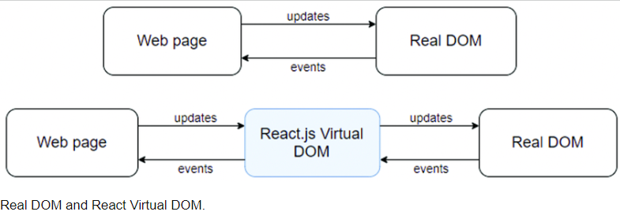

# Dom Nedir ?

DOM (Document Object Model), bir web sayfasının yapısını temsil eden bir programlama arayüzüdür. HTML, XML veya XHTML gibi belge türlerini bir ağaç yapısı olarak temsil eder. Bu ağaç yapısı, her bir HTML etiketi veya XML düğümü için bir düğüm içerir.

Virtual DOM ise bir DOM soyutlamasıdır ve genellikle web uygulama geliştirme çerçevelerinde kullanılır. React gibi kütüphaneler, Virtual DOM'un avantajlarından yararlanır.

## Dom ve Virtual Dom Farkları 

**DOM:** Web tarayıcısında gerçekten bulunan belge nesnesini temsil eder. DOM, her bir HTML etiketi veya XML düğümü için bir JavaScript nesnesi olarak temsil edilir. DOM, kullanıcı arayüzünün manipüle edilmesine izin verir, ancak bu işlem bazen yavaş olabilir çünkü DOM manipülasyonları doğrudan tarayıcıya yapılır.

**Virtual DOM:** DOM'un soyut bir temsilidir. JavaScript nesnelerinden oluşan bir sanal ağaçtır. Değişiklikler, gerçek DOM'a uygulanmadan önce önce bu sanal ağaç üzerinde yapılır. React gibi kütüphaneler, bu sanal ağacı kullanarak DOM manipülasyonlarını optimize eder. Örneğin, bir bileşen güncellendiğinde, tüm DOM'u güncellemek yerine, değişiklikler önce Virtual DOM üzerinde yapılır, ardından gerçek DOM ile karşılaştırılır ve yalnızca değişiklikler gerçek DOM'a uygulanır.

### Virtual Dom Avantajları

**Performans:** Virtual DOM, gerçek DOM manipülasyonlarını minimize ederek performansı artırır. Çünkü gerçek DOM manipülasyonları pahalı işlemlerdir ve tarayıcıda yeniden boyutlandırma ve yeniden çizim gibi işlemlere neden olabilir

**İşlem Kolaylığı:** Virtual DOM, geliştiricilere daha kolay bir geliştirme deneyimi sunar. React gibi kütüphaneler, bileşen tabanlı geliştirme sunarak uygulama yapısını daha modüler hale getirir.

**Hızlı Yeniden Çizim:** Virtual DOM, gerektiğinde yalnızca değişen kısımları günceller. Bu, gereksiz yeniden çizimlerin önlenmesine ve performansın artırılmasına yardımcı olur.

### Virtual Dom Dezavantajları

**Başlangıç Tepkisi:** Virtual DOM'un kullanılması, bazı durumlarda başlangıç yükünü artırabilir. İlk olarak sanal DOM'un oluşturulması gerektiğinden, küçük projelerde bu bir dezavantaj olabilir.

**Bellek Tüketimi:** Virtual DOM'un bellek tüketimi daha yüksek olabilir, çünkü gerçek DOM'a kıyasla daha fazla bellek kullanımı gerektirir.

Genel olarak, Virtual DOM'un avantajları gerçek DOM manipülasyonlarını optimize etmek ve performansı artırmak için dezavantajlarından daha ağır basar. Bu nedenle, modern web uygulamaları genellikle Virtual DOM kullanan kütüphaneler veya çerçeveler üzerine inşa edilir.

