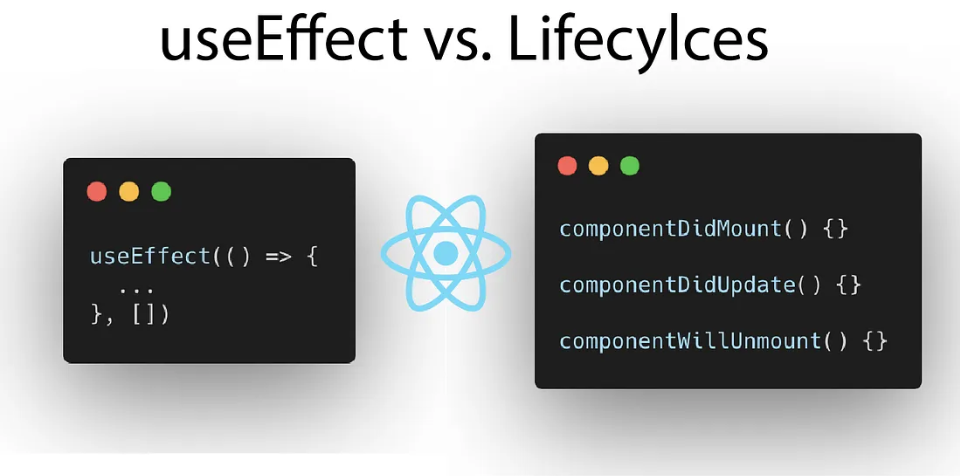

# Lifecycle Nedir ?

<div style="display: flex; justify-content: center; align-items: center;">

</div>

React yaşam döngüsü (React Lifecycle), bir React bileşeninin (component) oluşturulma, güncellenme ve yok edilme aşamalarını kapsayan süreçler bütünüdür.

Bu kavram, React bileşenlerinin nasıl çalıştığını anlamak ve uygulamalarınızı daha verimli bir şekilde yönetmek için çok önemlidir. React 16.8 sürümüyle birlikte, Hooks adı verilen yeni bir özellik tanıtıldı ve useEffect gibi hook'lar, fonksiyonel bileşenlerde yaşam döngüsü yönetimini mümkün kıldı.

React'te sınıf (class) bileşenleri ve fonksiyonel (functional) bileşenler arasında yaşam döngüsü yönetimi açısından bazı farklar bulunmaktadır. Her iki tür bileşen de React uygulamalarının temel yapı taşlarıdır, ancak yaşam döngüsü olaylarına yanıt verme şekilleri farklıdır.

React yaşam döngüsünü anlamak, bileşenlerinizin ne zaman ve neden güncellendiğini kontrol etmenize, yan etkileri (side effects) yönetmenize ve uygulamanızın performansını artırmanıza yardımcı olur. Ayrıca, memmory leak önlemek, gereksiz güncellemeleri azaltmak ve daha tutarlı bir kullanıcı deneyimi sağlamak için de kritik bir öneme sahiptir.

## Class Component'da Yaşam döngüsü

Sınıf bileşenleri, React'ın erken sürümlerinde yaşam döngüsü yönetiminin temelini oluşturur. Bu bileşenler React.Component sınıfından türetilir ve yaşam döngüsü metodlarını içerirler.

1. **Mounting:**
   Bu aşama, bileşenin DOM'a eklenme sürecini kapsar.

- **constructor(props):** Bileşen oluşturulduğunda çağrılır.

- **static getDerivedStateFromProps(props, state):** Bileşen oluşturulduğunda ve her güncellemede çağrılır.

- **render():** Bileşenin DOM'a nasıl render edileceğini belirtir.

- **componentDidMount():** Bileşen DOM'a eklendikten hemen sonra çağrılır.

2. **Updating**

Bileşenin props veya state'indeki değişiklikler sonucu güncellenmesi sürecidir.

- **static getDerivedStateFromProps(props, state):** Props değişikliklerine bağlı olarak state'i güncellemek için kullanılır.
  shouldComponentUpdate(nextProps, nextState):\*\* Bileşenin güncellenip güncellenmeyeceğini belirlemek için kullanılır. Performans optimizasyonu için önemlidir.

- **render():** Güncellenmiş UI'ı render etmek için çağrılır.

- **getSnapshotBeforeUpdate(prevProps, prevState):** Güncelleme öncesindeki props ve state'e göre bilgi toplamak için kullanılır. Güncelleme sonrası DOM değişikliklerine yanıt vermek için bir snapshot (anlık görüntü) değeri döndürebilir.

- **componentDidUpdate(prevProps, prevState, snapshot):** Bileşen güncellendikten sonra çağrılır. Önceki props, state veya snapshot üzerinde işlemler yapılabilir.

3. **Unmounting**

- **componentWillUnmount():** Bileşen DOM'dan sökülmeden hemen önce çağrılır. Aboneliklerin iptal edilmesi, zamanlayıcıların temizlenmesi gibi temizlik işlemleri için kullanılır.

Biliyorum bu şekilde bakınca birazcık karmaşık duruyor. Gelin bir de useEfect ile lifeCycle nasıl yürüttüğümüze bakalım.

## Functional Component'da Yaşam döngüsü

React Hooks'un tanıtımıyla birlikte, fonksiyonel bileşenler artık sınıf bileşenleri kadar yetenekli hale geldi ve yaşam döngüsü yönetimi `useEffect` Hook'u aracılığıyla sağlanabilir.

`useEffect` Hook'u: Fonksiyonel bileşenlerde yan etkileri (side effects) yönetmek için kullanılır. Bu, sınıf bileşenlerindeki `componentDidMount`, `componentDidUpdate`, ve `componentWillUnmount` metodlarının bir kombinasyonu gibi çalışır.

Temel olarak React altından çağrılan useEfect hooku içinde bir Callback ve bir Dependencies Array'i alır callback component içerisinde çalıştırmak istediğimiz işlemleri belirlerken dependencies arrayi içinde bunların neye bağlı olarak gerçekleşeceğini belirliyoruz.

```jsx
useEffect(() => {
  // Bileşen monte edildiğinde ve/veya güncellendiğinde çalışacak kod

  return () => {
    // Bileşen DOM'dan kaldırılmadan önce çalışacak temizlik kodu
  };
}, [dependencies]); // Bağımlılıklar dizisi
```

### useEfect Kullanım Senaryoları

1. **Her Render Sonrası Çalıştırma**

Bazı durumlarda, bir bileşenin her render işleminden sonra bazı işlemleri gerçekleştirmek isteyebilirsiniz. Bu, bağımlılıklar dizisini tamamen yoksayarak (useEffect içinde belirtmeyerek) yapılabilir. Bu gibi senaryolara çok ihtiyaç duymasak kullanılan bir methoddur

```jsx
useEffect(() => {
  // Bileşen her render edildiğinde bu kod çalışır.
  console.log("Bileşen render edildi veya güncellendi.");
});
```

2. **Belirli Bir Değişkendeki Değişiklikleri İzleme**

Bir state veya prop değiştiğinde yan etki işlemlerini tetiklemek için, bu değişkeni useEffect'in bağımlılıklar dizisine ekleyebilirsiniz. Örnek olarak her count değeri değişiminde console'a count deperini yazdıralım.

```jsx
const [count, setCount] = useState(0);

useEffect(() => {
  // 'count' değişkeni her değiştiğinde bu kod bloğu çalışır.
  console.log(`Count değişti: ${count}`);
}, [count]); // 'count' bağımlılık listesine eklendi.
```

3. **Sayfa İlk Render Anında Çalıştırma**

Bir bileşen DOM'a ilk kez monte edildiğinde çalışması gereken kodlar için, useEffect içindeki işlevi tanımlayıp, bağımlılıklar dizisini boş bırakabilirsiniz.

```jsx
const [count, setCount] = useState(0);

useEffect(() => {
  // API'den veri çekme gibi işlemler burada yapılır.
  console.log("Comonent Render Edildi.");
}, []);
```

4. **Cleanup işlemi**

Bir abonelik başlatma veya event listener eklemenin yan etkilerini gerçekleştirirken, bileşen DOM'dan kaldırılmadan önce bu işlemleri temizlemeniz gerekebilir. Bu işlem useEffect içinde geri dönüş (return) fonksiyonu ile yapılır.

```jsx
const [count, setCount] = useState(0);

useEffect(() => {
  // Cagrılacak işlem
  // Cleanup fonksiyonu
  return () => {
    // Temizlenecek kısım.
  };
}, []);
```

Bazı senaryolarda setInterval kullanırken karşılaşılan en yaygın sorunlardan biri, bileşen DOM'dan kaldırıldıktan sonra interval'ın devam etmesidir. Bu, hafıza sızıntılarına (memory leaks) yol açabilir çünkü artık mevcut olmayan bir bileşenin state'ini güncellemeye çalışır.

Bu tür sorunların önüne geçmek için, React'ın yaşam döngüsü metodları veya Hook'ları kullanarak interval'ı temizlemek (clear) önemlidir.

```jsx
const [count, setCount] = useState(0);

useEffect(() => {
  const intervalId = setInterval(() => {
    // Her 1000 ms (1 saniye) sonra bu fonksiyon çalışır
    console.log("Interval çalışıyor...");
  }, 1000);

  // Temizleme fonksiyonu
  return () => clearInterval(intervalId);
}, []);
```

### useEfect Hokku Kullanırken Dikkat Edilmesi Gerkenler

1. **Bağımlılıklar Dizisini Doğru Kullanmak**

- **Bağımlılıkları eksik bırakmak:** useEffect içinde kullanılan herhangi bir state veya prop varsa, bunlar bağımlılıklar dizisine eklenmelidir. Aksi takdirde, yan etki eski prop veya state değerleri ile çalışabilir.

- **Boş bağımlılıklar dizisi:** Eğer bağımlılıklar dizisi olarak boş bir dizi ([]) kullanılırsa, yan etki sadece bileşen ilk render anında bir kez çalışır. Bileşenin her render'ında çalışmasını istemiyorsanız bu yaklaşımı kullanabilirsiniz.

- **Gereksiz render'ları önlemek:** Bağımlılıklar dizisinde çok fazla değer varsa ve bu değerler sık sık değişiyorsa, useEfect çok sık çalışabilir. Bu durum, gereksiz render'lara ve potansiyel performans sorunlarına yol açabilir.

**Doğru**

```jsx
function ExampleComponent({ userID }) {
  const [user, setUser] = useState(null);

  useEffect(() => {
    async function fetchUserData() {
      const response = await fetch(`https://api.example.com/users/${userID}`);
      const userData = await response.json();
      setUser(userData);
    }
    fetchUserData();
  }, [userID]); // userID bağımlılık listesinde, bu yüzden userID değiştiğinde yeniden çalışır.

}
```

**Yanlış**

```jsx
function ExampleComponent({ userID }) {
  const [user, setUser] = useState(null);

  useEffect(() => {
    async function fetchUserData() {
      const response = await fetch(`https://api.example.com/users/${userID}`);
      const userData = await response.json();
      setUser(userData);
    }
    fetchUserData();
  }); // Bağımlılıklar dizisi belirtilmedi. Bu, userID değişse bile fetchUserData'nın yeniden çalışmamasına yol açar.

}
```


2. **Temizleme Fonksiyonunu Kullanmak**

Yan etkiler bazen temizlenmeyi gerektirir (örneğin, setInterval kullanımında, abonelikler veya event listener'lar). Bileşen unmount edildiğinde veya yeniden render edilmeden önce bu temizlik işlemlerini yapmak için useEffect içinde bir temizleme fonksiyonu döndürmek önemlidir.

**Doğru**

```jsx
function TimerComponent() {
  useEffect(() => {
    const timerID = setInterval(() => {
      console.log('Timer çalışıyor...');
    }, 1000);

    return () => clearInterval(timerID); // Doğru temizleme. Bileşen kaldırıldığında timer durdurulur.
  }, []);
}
```

**Yanlış**

```jsx
function TimerComponent() {
  useEffect(() => {
    setInterval(() => {
      console.log('Timer çalışıyor...');
    }, 1000);
    // Temizleme fonksiyonu yok. Bileşen kaldırıldığında timer hala çalışmaya devam eder.
  }, []);
}
```

3. **Döngüsel Bağımlılıklardan Kaçınmak**

useEffect içinde state güncelleyen bir işlem yapılıyorsa ve bu state de yan etkinin bir bağımlılığıysa, dikkatli olunmalıdır. Bu durum, istenmeyen döngüsel bağımlılıklara ve sonsuz döngülere yol açabilir.


4. **Performans Optimizasyonu**

Bazı yan etkiler, bileşenin her güncellemesinde çalıştırılmak zorunda değildir. Yan etkiyi yalnızca belirli değerler değiştiğinde çalıştırmak için bağımlılıklar dizisini akıllıca kullanın. Böylece gereksiz işlemleri önleyerek uygulamanızın performansını artırabilirsiniz.

**Doğru**

```jsx
function MyComponent({ userID }) {
  const [userInfo, setUserInfo] = useState(null);

  useEffect(() => {
    // Yalnızca userID değiştiğinde çalışır, gereksiz fetch işlemlerini önler.
    fetchUserInfo(userID).then(setUserInfo);
  }, [userID]);

}

```

**Yanlış**

```jsx
function MyComponent({ userID }) {
  const [userInfo, setUserInfo] = useState(null);

  useEffect(() => {
    // Her render'da çalışır, gereksiz yere birçok fetch işlemi yapılmasına yol açar.
    fetchUserInfo(userID).then(setUserInfo);
  });

}

```