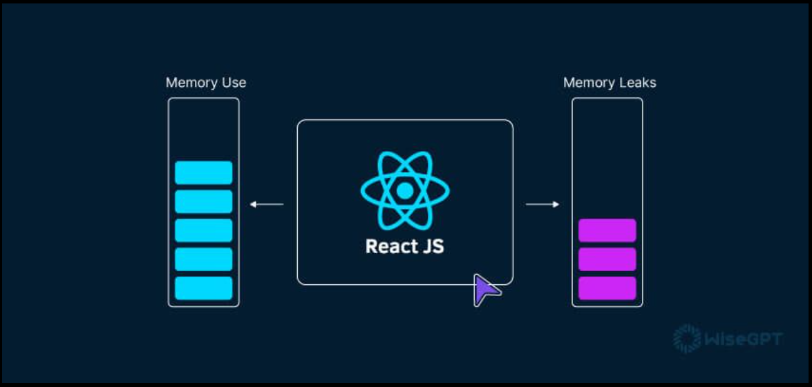

# Memory Leak

<div style="display: flex; justify-content: center; align-items: center;">

</div>

Memory leak (bellek sızıntısı), bir uygulamanın çalışması sırasında kullanılmayan belleğin zamanla gereksiz yere işgal edilmesi ve bu belleğin geri kazanılamaması durumudur. Bellek sızıntıları, uygulamanın performansını düşürebilir, yanıt süresini uzatabilir ve hatta uygulamanın veya sistem çökmesine neden olabilir. JavaScript ve React gibi garbage collection mekanizmasına sahip ortamlarda bile bellek sızıntıları meydana gelebilir.

## React Uygulamasında Memory Sızıntısını Tespit Etme

1. **Artan Hafıza Kullanımı:** Uygulamanızın hafıza kullanımını zamanla izleyin ve önemli bir azalma olmaksızın hafıza kullanımında sürekli bir artış fark ederseniz, bu bir hafıza sızıntısına işaret ediyor olabilir.

2. **Performans Bozulması:** Hafıza sızıntıları, uygulamanızın genel performansını etkileyebilir. Eğer renderlama (çizim) işleminde kademeli bir yavaşlama veya artan yükleme süreleri gözlemliyorsanız, bu hafıza sızıntılarının bir belirtisi olabilir.

3. **Çökme veya Donma:** Ciddi durumlarda, hafıza sızıntıları, aşırı hafıza kullanımı nedeniyle uygulamanızın çökmesine veya donmasına neden olabilir. Uygulamanız yanıt vermez hale gelirse veya beklenmedik şekilde çökerse, olası hafıza sızıntısı sorunlarını araştırmak çok önemlidir.

## React.js'de Hafıza Sızıntılarının Yaygın Nedenleri

Hafıza sızıntılarını etkili bir şekilde düzeltebilmek için, onların yaygın nedenlerini anlamak önemlidir. İşte React uygulamalarında hafıza sızıntılarına yol açabilecek tipik senaryolar:

1. **Event listeners** React bileşenlerinizin içindeki elementlere olay dinleyicileri eklerseniz ancak bileşen çıkarıldığında bunları kaldırmazsanız, bu hafıza sızıntılarına yol açabilir. Olay dinleyicilerini bileşenin temizleme fonksiyonunda kaldırdığınızdan emin olun, örneğin `useEffect` hook'unda bir temizleme fonksiyonu ile veya bir sınıf bileşeninin `componentWillUnmount` yaşam döngüsü metodunda.

```jsx
import React, { useEffect } from "react";

function ExampleComponent() {
  useEffect(() => {
    // Olay dinleyicisi ekleyin
    window.addEventListener("resize", handleResize);

    // Temizleme fonksiyonu
    return () => {
      // Bileşen çıkarıldığında olay dinleyiciyi kaldırın
      window.removeEventListener("resize", handleResize);
    };
  }, []); // Boş dizi, bu efektin bileşen monte edildiğinde bir kez çalıştırılacağını belirtir

  function handleResize() {
    console.log("Pencere boyutu değişti!");
  }

  return <div>Örnek Bileşen</div>;
}
```

2. **Abonelik Tabanlı API'ler:t** Abonelik tabanlı API'leri, örneğin WebSocket bağlantıları veya gözlemlenebilir nesneler (observables) kullanıyorsanız, bunlara artık ihtiyaç duyulmadığında bu abonelikleri iptal etmek veya kapatmak çok önemlidir. Bu kaynaklardan aboneliği iptal etmemek, referansların aktif kalmasına ve hafıza sızıntılarına neden olabilir. useEffect içindeki temizleme fonksiyonunu kullanarak bu abonelikleri iptal etmek veya kapatmak için kullanın.

```jsx
import React, { useEffect } from "react";
import { Observable } from "rxjs"; // RxJS gözlemlenebilir nesnesini temsilen

function ExampleComponent() {
  useEffect(() => {
    const subscription = someObservable.subscribe((data) => {
      console.log(data);
    });

    // Temizleme fonksiyonu
    return () => {
      // Abonelik iptal ediliyor
      subscription.unsubscribe();
    };
  }, []); // Boş dizi, efektin bileşen monte edildiğinde bir kez çalıştırılacağını belirtir

  return <div>Örnek Bileşen</div>;
}
```

3. **Uygunsuz Kapanış (Closure) Kullanımı:** Kapanışlar (closures), yanlışlıkla çöp toplanması gereken nesnelere referanslar sakladıklarında hafıza sızıntılarına neden olabilirler. Örneğin, olay işleyicileri içinde kapanışlar kullanıyorsanız ve bileşenin kapsamından değişkenler yakalıyorsanız, bu yakalanan değişkenler tüm bileşeni ve onunla ilişkili nesneleri hafızada tutabilir. Kapanışlarda hangi değişkenlerin yakalandığını dikkatle değerlendirin ve fonksiyonları düzgün bir şekilde belleğe almak için useCallback hook'unu kullanmayı düşünün.

```jsx
let closure;

function createClosure() {
  const largeArray = new Array(1000000);

  closure = () => console.log(largeArray);
}

createClosure();
```

Kapanışlar, bir fonksiyonun kendi kapsam dışındaki değişkenlere hala erişebilmesini sağlayan güçlü bir JavaScript özelliğidir. Ancak, bu özellik yanlış kullanıldığında, gereksiz hafıza kullanımına ve hafıza sızıntılarına yol açabilir.

4. **Büyük Datasetler ve Stateler** Bileşenin durumunda büyük veri kümeleri veya gereksiz verilerin saklanması, özellikle veriler gereksiz hale geldiğinde düzgün bir şekilde temizlenmediğinde, hafıza sızıntılarına yol açabilir. Uygun olduğunda, önceki bahsedilen temizleme fonksiyonlarında olduğu gibi, durumdan veya diğer veri yapılarından gereksiz verileri kaldırmayı veya temizlemeyi unutmayın.

```jsx
import React, { useState, useEffect } from "react";

function LargeDataSetComponent() {
  const [data, setData] = useState([]);

  useEffect(() => {
    const fetchData = async () => {
      const response = await fetch("https://api.example.com/data");
      const newData = await response.json();
      setData(newData);
    };

    fetchData();

    // Temizleme fonksiyonu veriyi temizlemek için
    return () => {
      setData([]);
    };
  }, []);

  return <div>{/* Veriyi burada göster */}</div>;
}
```

5. **Üçüncü Parti Kütüphaneler** Üçüncü parti kütüphaneler, doğru kullanılmadıklarında hafıza sızıntılarına yol açabilir. Kütüphane geliştiricileri tarafından sağlanan belgelendirmeyi ve en iyi uygulamaları takip ettiğinizden emin olun, özellikle temizlik ve kaynak bertarafı söz konusu olduğunda.

6. **Zamanlayıcılar** clearTimeout veya clearInterval ile temizlenmeyen zamanlayıcılar.
