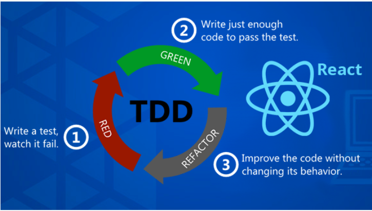

# Test Driven Development (TDD)

Test Driven Development (TDD), yazılım geliştirme sürecinde testlerin öncelikle yazılmasını ve ardından bu testleri geçecek kodun yazılmasını öneren bir metodolojidir. React uygulamalarında TDD yaklaşımını benimsemek, uygulamanın daha sağlam ve hata oranı düşük olmasını sağlar. React bileşenlerini test etmek için Jest ve React Testing Library sıklıkla kullanılan araçlardır.

TDD üç aşamada olur

**1. Adım Testin Yazılması :**

İlk adım, henüz implemente edilmemiş bir özelliğe odaklanan bir test yazmaktır. Bu test başlangıçta başarısız olacaktır çünkü ilgili özellik henüz geliştirilmemiştir.

**2. Adım Kodu Yazma :**

Testi geçecek minimum miktarda kodu yazın. Bu aşama, test başarılı oluncaya kadar kod üzerinde iterasyon yapmayı gerektirebilir.

**3. Adım Refactor :**

Kodun çalıştığını ve testleri geçtiğini gördükten sonra, kod kalitesini artırmak, tekrarları azaltmak ve okunabilirliği iyileştirmek için kod üzerinde yeniden düzenleme (refactoring) yapın.

## TDD'nin Avantajları

1. **Daha Az Hata :** TDD, hataları erken aşamada tespit ederek uygulamanın daha kararlı olmasını sağlar.

2. **Daha İyi Tasarım :** Kodu test edilebilir hale getirmek, genellikle daha iyi yazılım tasarımına yol açar.

3. **Geliştirici Güveni :** Geliştiriciler, yeni özellikler eklerken veya mevcut kodu değiştirirken daha güvende hissederler, çünkü testler potansiyel hataları hızla tespit edebilir.

4. **Dokümantasyon :** Yazılan testler, kodun nasıl çalıştığına dair yaşayan dokümantasyon görevi görür.

## Jest

Jest, Facebook tarafından geliştirilen ve özellikle React uygulamaları için popüler bir JavaScript test çerçevesidir. Birim testleri, entegrasyon testleri ve snapshot testleri yapmak için kullanılır. Jest'in otomatik olarak testleri bulma, paralel olarak çalıştırma ve mock objeler oluşturma gibi özellikleri vardır.

<a href="https://jestjs.io/docs/getting-started">Döküman</a>

## React Testing Library

React Testing Library, React bileşenlerini test etmek için kullanılan bir kütüphanedir. DOM düğümleri üzerinde işlem yapmanıza ve kullanıcı etkileşimlerini simüle etmenize olanak tanır. Jest ile birlikte kullanıldığında, React uygulamalarınızda kullanıcı davranışlarını daha gerçekçi bir şekilde test edebilirsiniz.

<a href="https://testing-library.com/docs/react-testing-library/intro/">Döküman</a>
