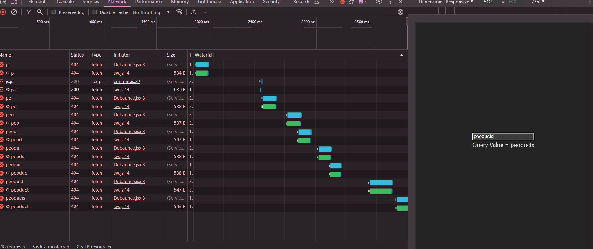
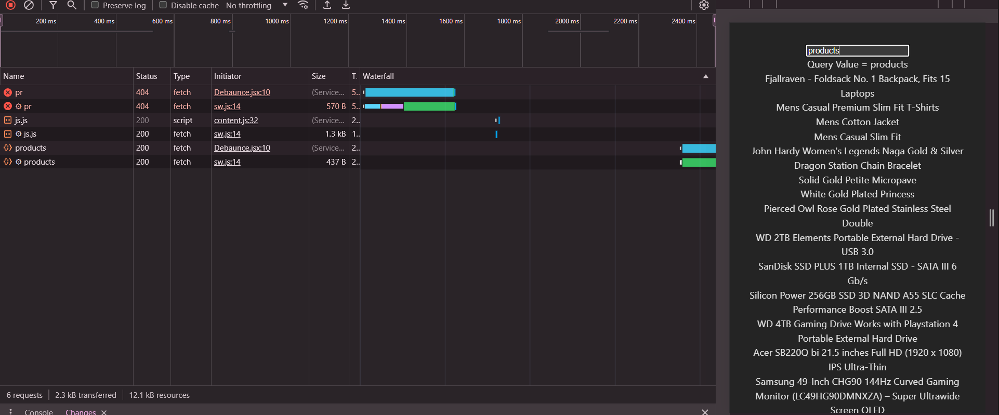

# **Debounce**

Debounce, bir fonksiyonun tekrar tekrar çağrılmasını belirli bir gecikme süresi boyunca erteleme ve sadece belirli bir bekleme süresi sonunda bir kez çalıştırma yöntemidir. React'ta, kullanıcı girişleri, API aramaları veya pencere boyutlandırma gibi sıkça gerçekleşebilecek olayları işlerken debounce kullanmak yaygındır. Bu teknik, performansı iyileştirmeye ve gereksiz iş yükünü azaltmaya yardımcı olur. Sorunu daha iyi anlayabilmek için bir adet api inputtan dönen değerimizle sorgu atalım ve ne gibi durumlarla karşılaşıyoruz bunu görelim.

```jsx
import { useEffect, useState } from "react";

function Debaunce() {
  const [value, setValue] = useState("");
  const [data, setData] = useState([]);

  useEffect(() => {
    fetch(`https://fakestoreapi.com/${value}`)
      .then((res) => res.json())
      .then((json) => setData(json));
  }, [value]);

  console.log(data);

  return (
    <div>
      <input
        type="text"
        value={value}
        onChange={(e) => setValue(e.target.value)}
      />

      <div> Query Value = {value}</div>
      {data.length > 0 &&
        data.map((item) => <div key={item.id}>{item.title}</div>)}
    </div>
  );
}

export default Debaunce;
```

Debounce tekniği, özellikle bir kullanıcı girdi alanına veri girerken (örneğin, bir arama kutusunda yazarken) sürekli olarak gerçekleşen işlemleri kontrol altına almak için kullanılır. Yukarıdaki kod örneğinde, bir kullanıcı input alanına her karakter girdiğinde, bir API isteği gönderiliyor. Eğer bu durum bir arama veya filtreleme fonksiyonu için kullanılıyorsa, her bir harf yazıldığında API'ye yapılan çağrı sayısının çok yüksek olması, aşırı ağ trafiği ve gereksiz yüklenme sürelerine yol açabilir. Bu da hem kullanıcı deneyimini olumsuz etkiler hem de sunucu kaynaklarını gereksiz yere tüketir.

  

  Your browser does not support the video tag.
</video>
Debounce tekniği, kullanıcının yazmayı bitirmesini bir süre bekler ve belirlenen zaman dilimi içinde sadece bir kez API isteği yapılmasını sağlar. Bu, özellikle arama işlevleri gibi gerçek zamanlı veri işleme gerektiren durumlar için idealdir. Bu yöntem sayesinde, kullanıcı girdi alanına her karakter girdiğinde değil, belirli bir süre boyunca herhangi bir giriş yapılmadığında istek gönderilir. Böylece ağ trafiği azaltılır, sunucu üzerindeki yük hafifler ve kullanıcıya daha akıcı bir deneyim sunulmuş olur.

öncelikle useDebaunce diye custom bir hook oluşturalım ve kullanıcıda bir adet value ve delay parametrelerini alalım

```jsx
import { useEffect, useState } from "react";

function useDebounce(value, delay) {
  const [debouncedValue, setDebouncedValue] = useState(value);

  useEffect(() => {
    // setTimeout ile gelen veriyi delaya göre güncelliyoruz bu da ardışık şekilde inputa veri girilince gecikmesini sağlıyor
    const handler = setTimeout(() => {
      setDebouncedValue(value);
    }, delay);
    //   en son setTimeout temizliyoruz
    return () => {
      clearTimeout(handler);
    };
  }, [value, delay]);

  // geriye debounce edilmiş debouncedValue dönüyoruz
  return debouncedValue;
}

export default useDebounce;
```

**Entegrasyon**

```jsx
import { useEffect, useState } from "react";
import useDebounce from "../helpers/useDebaunce";

function Debaunce() {
  const [value, setValue] = useState("");
  const [data, setData] = useState([]);
  const debouncedValue = useDebounce(value, 500);
  useEffect(() => {
    if (value) {
      fetch(`https://fakestoreapi.com/${value}`)
        .then((res) => res.json())
        .then((json) => setData(json));
    }
  }, [value]);

  console.log(data);

  return (
    <div>
      <input
        type="text"
        value={value}
        onChange={(e) => setValue(e.target.value)}
      />

      <div> Query Value = {value}</div>
      {data.length > 0 &&
        data.map((item) => <div key={item.id}>{item.title}</div>)}
    </div>
  );
}

export default Debaunce;
```

Networkde oluşan trafiği izlediğimiz zaman kullanıcı girdisine göre api istek atarken neden debaunce tektiğini kullanmamız gerekiyor daha iyi bir şekilde anlaşılıyor .

  
